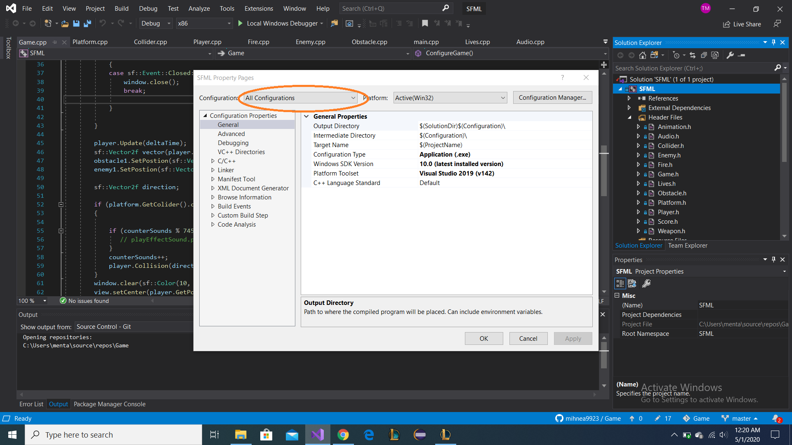
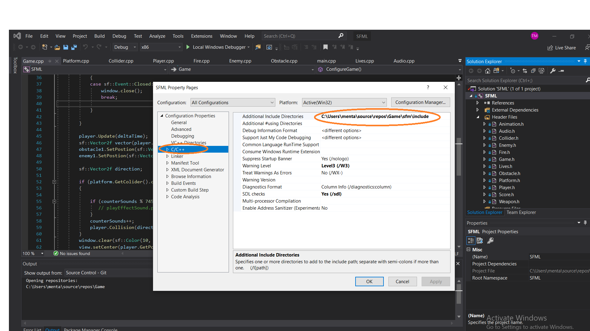
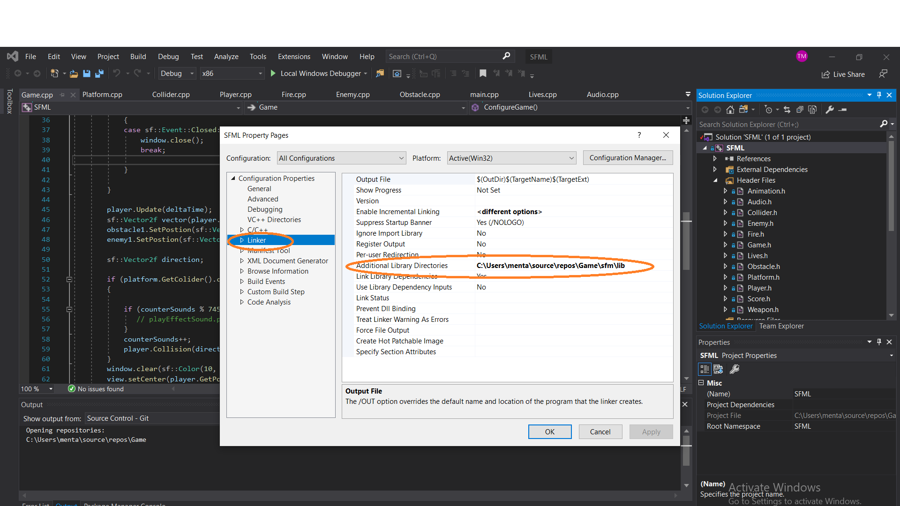

# Game
Simple C++,SFML 2D game.  
In order to be able to compile the game follow the next steps:  
1.Go to properties and make sure you selected all configurations.  
  
2.Go to C/C++ and change the path for "Additional Include Directories" to the same "include" file which is found in folder Game/sfm/include.You have to change that path since the place where your solution folder will have a different path(not C:\Users\menta\source\repos).For example if your folder is created on dekstop the path should be something like C:\Users\xxxxxx\Game\sfm\include.  
  
3.Go to Linker and change path for "Additional Library Directories" and it should be similar with step 2,the only difference beeing that now you have to add the lib folder which is found in Game/smf/lib.  

